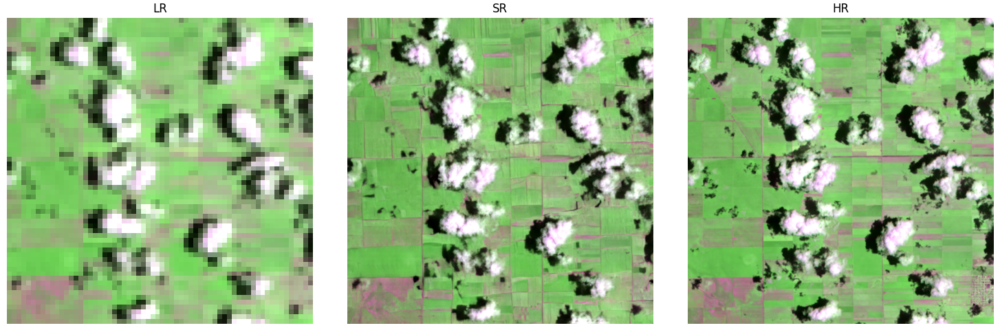

# Summary

OpenSR-SRGAN is a modular, configuration-driven framework for training and benchmarking SRGAN-style super-resolution models on multispectral Earth-observation data. The software enables users to train and evaluate configurable generator–discriminator architectures on arbitrary sensor band setups using concise YAML configurations, without modifying model code. All components, such as generators, discriminators, loss functions, training schedules, normalizations, and stability heuristics, are exposed through a common YAML interface. OpenSR-SRGAN makes it straightforward to reproduce experiments, compare architectures, and deploy super-resolution pipelines across diverse remote-sensing datasets.

OpenSR-SRGAN supports complete end-to-end workflows with minimal setup: selecting architectures, scaling factors, band combinations, and training strategies entirely from configuration files. Although initially designed for remote-sensing super-resolution, the framework is domain-agnostic at its core and can be directly applied to other imaging modalities, such as medical imaging and standard computer-vision datasets, without architectural changes.

{#fig:banner}

# Introduction

Optical satellite imagery supports many geospatial applications, including agriculture [@agriculture], land-cover mapping [@mapping], ecosystem assessment [@ecosysetm] and disaster monitoring [@disaster]. Sensors such as Sentinel-2 provide rich multispectral data but at moderate spatial resolution, motivating single-image super-resolution (SISR) to recover finer detail from coarse observations.

Deep learning has driven major progress in SISR, with convolutional models improving fidelity and perceptual quality [@dong2015imagesuperresolutionusingdeep; @kim2016deeplyrecursiveconvolutionalnetworkimage]. GANs [@goodfellow2014generativeadversarialnetworks] introduced adversarial learning for synthesizing realistic high-frequency detail and are widely used in remote sensing [@11159252; @su2024intriguingpropertycounterfactualexplanation]. SRGAN [@ledig2017photo] extended these ideas to super-resolution and has been applied to multispectral data [@rs15205062; @9787539; @10375518; @satlassuperres].

Although diffusion and transformer-based models increasingly define the state of the art [@s1; @s2; @s3], GAN-based SR methods remain relevant for efficient and deterministic enhancement workflows [@g1; @allen].

# Statement of Need

GANs remain difficult to train [@p1; @p2; @p3], and these challenges are amplified in remote sensing, where models must handle multispectral inputs, high dynamic-range reflectance values, heterogeneous sensor characteristics, and limited availability of perfectly aligned high-resolution reference data. Existing open-source SRGAN implementations are typically designed for fixed RGB imagery and reproduce only a single architecture from the literature, offering little flexibility for modifying band configurations, normalization schemes, loss compositions, or training strategies. As a result, researchers who need to adjust models for different sensors (e.g., Sentinel-2, SPOT, Pleiades, PlanetScope, or other modalities such as medical imagery) must re-engineer core components, modify low-level code, and manually implement stabilization heuristics such as warmup, ramping, or EMA tracking, as well as logging mechanisms. This makes reproducing published experiments or conducting systematic comparisons across architectures labor-intensive, brittle, and inconsistent across studies. These challenges call for a flexible, extensible and configuration-first framework that reduces implementation overhead while enabling systematic experimentation across architectures, loss designs and multispectral sensor configurations.

# Software Overview

OpenSR-SRGAN provides a unified, modular and configuration-driven framework for training and evaluating GAN-based super-resolution models for multispectral remote sensing data. All components of an experiment, including architectures, losses, optimizers, data pipelines and training behavior, are defined through concise YAML files, which enables fully reproducible workflows without modifying source code. The framework supports arbitrary band configurations and adapts naturally to different sensors or imaging modalities.

The main features include:

- **Modular GAN framework:** Interchangeable generator and discriminator backbones with configurable depth, width and scale factors.  
- **Configuration-first workflow:** Fully reproducible training and evaluation using concise YAML definitions.  
- **Training stabilization options:** Warmup, adversarial ramping, label smoothing, spectral normalization, adaptive learning-rate scheduling and optional EMA tracking.  
- **Multispectral compatibility:** Native support for arbitrary band combinations across sensors.  
- **OpenSR ecosystem integration:** Standardized evaluation via `opensr-test` [@osrtest] and scalable inference utilities via `opensr-utils` [@osrutils].

A typical workflow in OpenSR-SRGAN involves selecting an architecture, defining the desired scale factor, specifying multispectral band ordering and choosing appropriate loss terms, all through a single YAML file. The framework then handles model construction, dataset loading, training procedures and evaluation, which allows researchers to focus on experiment design rather than implementation details. This approach is particularly useful when comparing multiple configurations or running ablation studies, since each experiment is fully defined and reproducible through its configuration file. Internally, the framework supports flexible loss composition, allowing pixel, perceptual, spectral and adversarial losses to be combined as needed. Users may also enable Wasserstein GAN training with an optional R1 gradient penalty [@arjovsky2017wasserstein], which can provide more stable optimization for multispectral or high dynamic-range data. These components together form a practical and extensible foundation for SRGAN experimentation, allowing users to explore architectures and training strategies while focusing on reproducibility rather than low-level implementation details.

# Limitations
Super-resolution methods enhance apparent detail but cannot replace imagery collected at native high resolution. OpenSR-SRGAN focuses on flexibility and reproducibility rather than state-of-the-art performance, and results still depend on proper preprocessing and accurate LR–HR alignment. GAN training in multispectral settings remains sensitive to dataset size and diversity, and may produce instability or spectral artifacts, particularly when reference data are limited or heterogeneous.

# Licensing and Availability
the source code is made available through the [ESAOpenSR/OpenSR-SRGAN](https://github.com/ESAOpenSR/SRGAN) Github repository. Full documentation, API references, quickstart guides and tips and tricks can be found at  [srgan.opensr.eu](https://srgan.opensr.eu). A reproducible notebook is permanently hosted on [Google Colab](https://colab.research.google.com/drive/16W0FWr6py1J8P4po7JbNDMaepHUM97yL?usp=sharing).
In the spirit of open science and collaboration, we encourage feature requests and updates, bug fixes and reports, as well as general questions and concerns via direct interaction with the repository. `OpenSR-SRGAN` is licensed under the Apache-2.0 license.

# Acknowledgement
This work has been supported by the European Space Agency (ESA) $\Phi$-Lab, within the framework of the ['Explainable AI: Application to Trustworthy Super-Resolution (OpenSR)'](https://eo4society.esa.int/projects/opensr/) Project.

# References